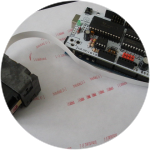

[![Badge Stars]][#]  
[![Badge License]][License]

 
 

# Projects

*Projects in the computer printing space.*

 
 

[][InkShield]

## **[InkShield]**

An **[Arduino]** shield to connect a **HP C6602 InkJet**  
cartridge turning it into a 96 DPI print platform.

 

<!----------------------------------------------------------------------------->

[Arduino]: https://www.arduino.cc/

[InkShield]: Projects/InkShield.md
[License]: LICENSE
[#]: #

<!---------------------------------[ Badges ]---------------------------------->

[Badge License]: https://img.shields.io/badge/-BY_SA_4.0-ae6c18.svg?style=for-the-badge&labelColor=EF9421&logoColor=white&logo=CreativeCommons
[Badge Stars]: https://img.shields.io/github/stars/OpenPrinters/Projects?style=for-the-badge&logoColor=white&logo=Trustpilot&labelColor=FF66AA&color=cf538b
